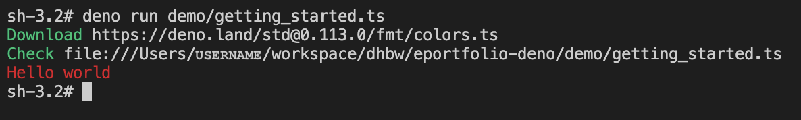

# eportfolio-deno

This is the repository for my e-Portfolio for software engineering course 2021/2022. The topic of this presentation was the [Deno runtime](https://deno.land/) which is an alternative to NodeJS.

## Installation

Deno ships with a single executable. It works on all common operating systems such as Windows 10, MacOS and some Linux distributions. For Deno to work, you need to install the Deno executable. For further information concerning installation, please refer to [Deno's homepage](https://deno.land/manual@v1.15.3/getting_started/installation). Here you can find any information concerning the installation.
After you've installed Deno, you're good to go.

Nevertheless, if you've any troubles during the installation process, feel free to reach out to me!

## Getting started

The whole code for this e-Portfolio can be found under the `demo/` directory. Each file contains a comment with the resource (if one was needed) and the command you need to run the code. Some commands only fit the file system under windows operating systems, therefore, you need to sometimes adapt the file paths for unixoid operating systems.

#### `getting_started.ts`

The code of the `getting_started.ts` file looks like the following:

```typescript
import { red } from "https://deno.land/std@0.113.0/fmt/colors.ts";

console.log(red("Hello world"));
```

At first, a small explaination what this code actually does. You can skip this part if you just want to check your installation for the e-Portfolio presentation, as it will be explained anyways.

The goal is simply to write the string `Hello world` to the console, however, not in standard white or black, but in a red font. This is accomplished with a additional module from Deno's standard library called `fmt`. However unlike NodeJs, Deno does not use CommonJS and it's `require()` function to import modules - it rather imports modules directly from their source. This can be a relative path such as `./utils.ts` or a url as you can see in the code above.

To get started, run `deno run demo/getting_started.ts` or `deno run .\demo\getting_started.ts` in Windows to run the first script. If that's your first time running this script, you'll see some additional logging in the console/terminal:



This shows you that Deno downloaded all the packages you included in your code - in our example the `color.ts` file from `https://deno.land`. If this is working on your system you're well prepared for using Deno.
